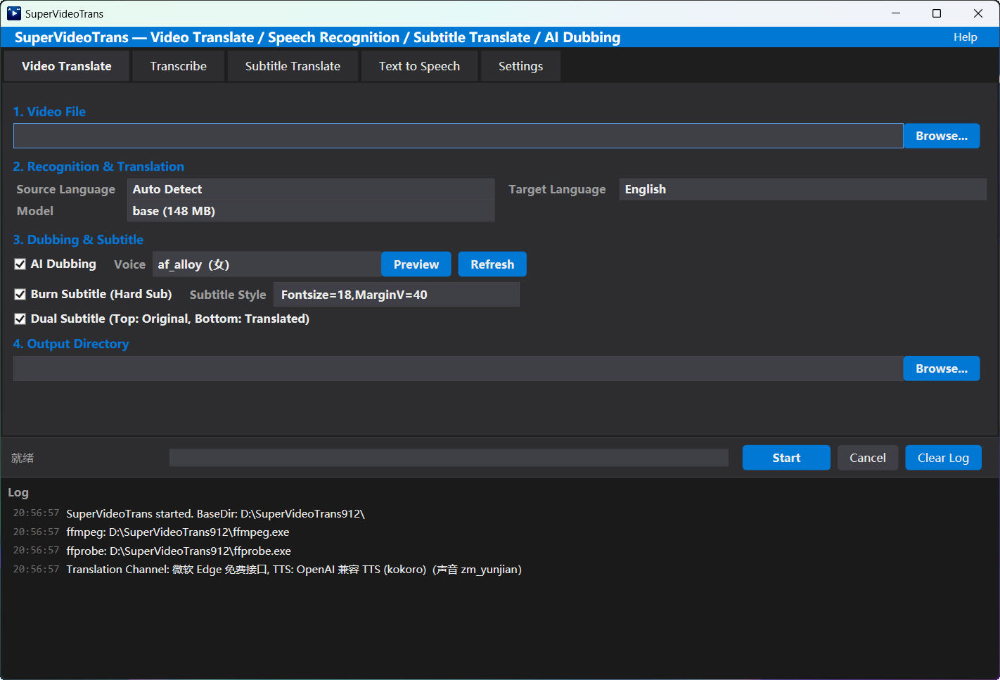
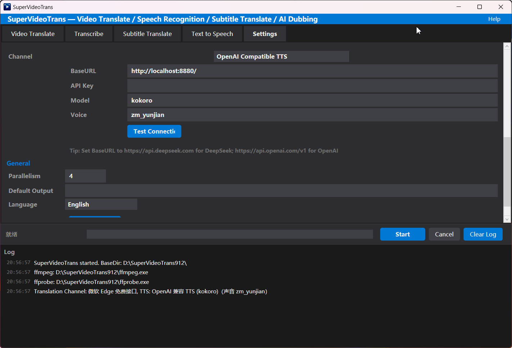
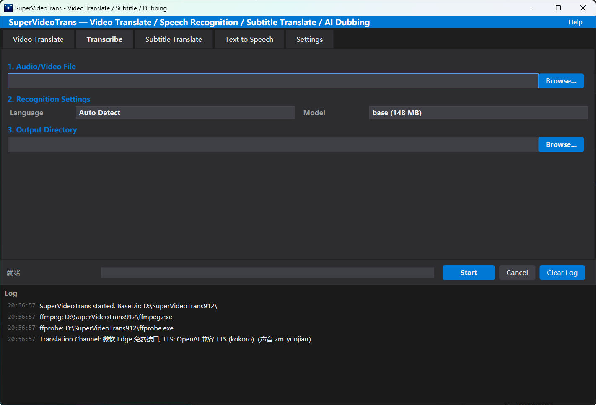

# SuperVideoTrans — 视频翻译 / 字幕 / AI 配音工具

> 一键视频翻译 · 语音识别 · 字幕翻译 · AI 配音
> One-click video translation · Speech recognition · Subtitle translation · AI dubbing

一个基于 **C# / .NET 9 / WPF** 的 Windows 桌面工具：导入视频，自动完成 「提取音频 → 语音识别 → 翻译 → AI 配音 / 烧录字幕 → 合成输出」 的全流程。

A Windows desktop tool built with **C# / .NET 9 / WPF**. Drop in a video and it automatically runs the full pipeline: **extract audio → transcribe → translate → AI dubbing / burned-in subtitles → mux & output**.

---

## ✨ 功能特性 / Features

- **视频翻译**：整条流水线一键完成，输出配音版 / 字幕版视频，并附带翻译字幕 SRT
- **转字幕**：音视频 → Whisper 本地语音识别 → SRT 字幕
- **字幕翻译**：SRT → 多语种翻译 → 翻译后 SRT
- **文本转语音**：SRT → 批量合成配音音轨（支持试听、刷新声音列表）
- **双语字幕**：可输出「上原文 / 下译文」双语字幕
- **硬字幕烧录**：直接压制进画面，字幕样式可自定义（如 `Fontsize=18,MarginV=40`）
- **GPU 加速**：Whisper 支持 CUDA；视频编码支持 NVENC 硬件编码
- **免费渠道**：Edge-TTS、Google 免费 TTS / 翻译、微软 Edge 翻译均可免费使用
- **本地大模型**：翻译支持 Ollama 本地大模型；配音支持本地 CosyVoice
- **网络代理**：可为 Google 翻译 / TTS 等配置 HTTP / SOCKS5 代理
- **多语言界面**：内置简体中文 / 英文界面切换；支持 30+ 语言翻译

---

## 🖼 界面截图 / Screenshots







---

## 🏃 快速上手 / Quick Start

1. **下载安装包**：从 Releases 下载 `SuperVideoTrans_Setup_*.exe` 并安装（Windows 10/11 x64）。
2. **第一次使用**：打开「设置」页，点击「自动检测 ffmpeg」（程序已内置 ffmpeg）；
   再下载 whisper-cli（CPU 版约 8MB / CUDA 版约 670MB）并下载识别模型（程序会自动从 ModelScope / HuggingFace 下载）。
3. **开始翻译**：切到「视频翻译」页 → 选择视频、源语言 / 目标语言 → 勾选是否配音 / 烧录字幕 → 选输出目录 → 点击「开始处理」。

> 提示：Whisper 程序与模型也支持手动指定已有路径；翻译 / 配音渠道请先在「设置」页配置。

---

## 🧩 支持渠道 / Supported Channels

### 翻译 / Translation

| 渠道 | 特点 |
| --- | --- |
| Google 免费接口 | 免费，需科学上网 |
| 微软 Edge 免费接口 | 免费 |
| 百度翻译 API | 免费注册，有配额 |
| DeepL API | 免费/付费 Key |
| OpenAI 兼容 | 兼容 DeepSeek / ChatGPT 等任一兼容接口 |
| Ollama | 本地大模型，数据不出本机 |

### 配音 / TTS

| 渠道 | 特点 |
| --- | --- |
| Edge-TTS | 微软免费神经语音，声音多 |
| Google 免费 TTS | 免费，HTTP/1.1 稳定 |
| OpenAI 兼容 TTS | 自备 Key，声音自然 |
| CosyVoice 本地 | 本地推理，可克隆音色 |

---

## 💻 技术栈 / Tech Stack

- C# · .NET 9 · WPF（MVVM，CommunityToolkit.Mvvm）
- 语音识别：Whisper（whisper.cpp，本地运行）
- 音视频处理：FFmpeg
- 全程异步管道 + 并发翻译 / 合成 + 断点续传下载

---

## 🛠 从源码构建 / Build from Source

```bash
# 需要 .NET 9 SDK
dotnet restore src/SuperVideoTrans/SuperVideoTrans.csproj
dotnet build  src/SuperVideoTrans/SuperVideoTrans.csproj -c Release
```

> 依赖：CommunityToolkit.Mvvm (MIT)。ffmpeg 二进制为 GPL 构建，详见 [THIRD_PARTY_NOTICES.md](./THIRD_PARTY_NOTICES.md)。

---

## 📄 许可与声明 / License & Notices

- 本软件**闭源发布**，© 作者保留所有权利。可免费使用，禁止商用倒卖与二次分发。
- 内置 FFmpeg 为 GPL 构建；Whisper 相关的程序与模型为 MIT 许可。
- 具体第三方声明见 **[THIRD_PARTY_NOTICES.md](./THIRD_PARTY_NOTICES.md)**。
- 免责声明：本软件仅调用各公开在线服务接口，语音 / 文本数据会发送至对应服务方，请自行评估数据安全与使用条款；滥用造成的后果由使用者自负。